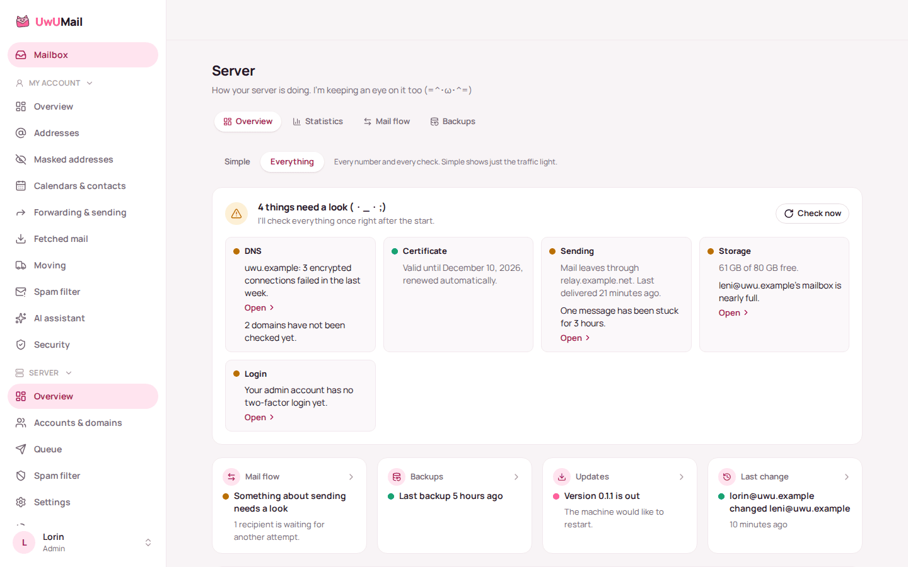
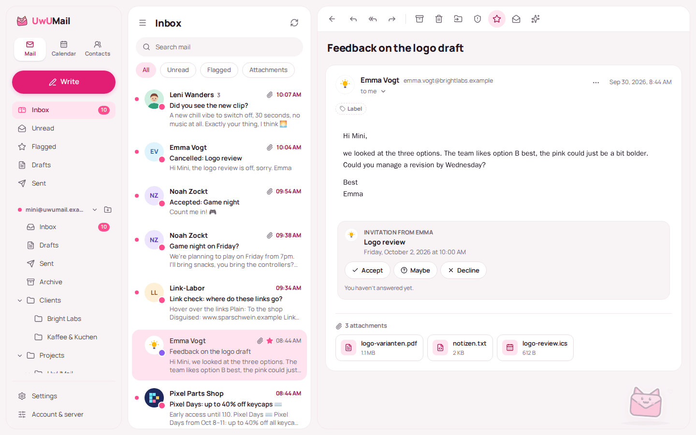
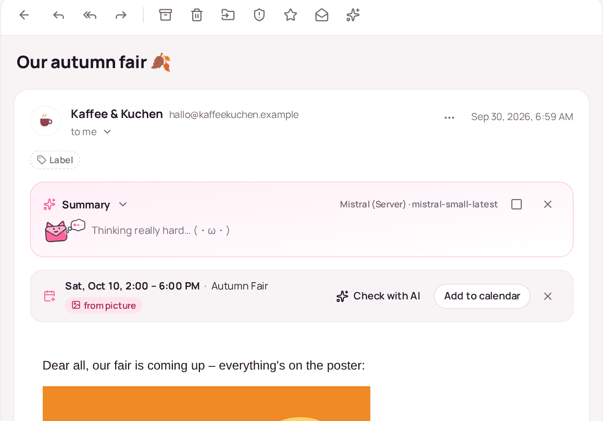
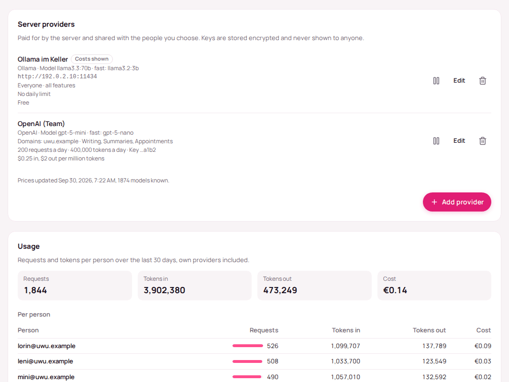

<p align="center">
  
</p>

<h1 align="center">UwUMail Server</h1>

<p align="center">
  The mail server I build for myself, because every self-hosted one annoyed me. (=^･ω･^=)<br/>
  JMAP · SMTP · IMAP · CalDAV/CardDAV · webmail · one Docker container
</p>

<p align="center">
  
</p>

---

## Why this exists

I'm building UwUMail Server for myself. Every self-hosted mail server I tried
annoyed me in one way or another, and so did the mail clients, so I started
building my own, the way I want it. The app half lives in
[UwUMail](https://github.com/MinifyX/UwUMail-Client).

- **Just for fun.** No company, no team, no schedule, no promises. I work on it
  when I have time and feel like it, so don't expect steady development, and
  don't be surprised by long breaks.
- **Written with AI.** Almost all of the code is written with Claude, because
  I'm honestly not a great programmer. Not your thing? No hard feelings, just
  pick something else.
- **Use it, fork it, do what you want with it.** The license only asks one
  thing: changed versions stay open, even when you only run them as a service.
- **No support.** Issues and pull requests are okay, but I might answer late or
  not at all, and I mostly build what I need myself.

## What it is

UwUMail Server is a self-hosted mail server written in Rust. It is the home
base for the UwUMail apps and works with other mail apps too. I want it to be
something a family, a club or a small team can run without being a mail admin.
The long version of every point is in [docs/features.md](docs/features.md):

- **One container.** Mail server, spam filter, admin portal and
  [webmail](docs/webmail.md) in a single image for amd64 and arm64 (yes, a
  Raspberry Pi is enough).
- **Guided setup.** An assistant walks you through admin account, domain, DNS
  and sending, checks everything live and ends with a test mail.
- **Delivers from home.** Blocked port 25 or no fixed IP? The optional
  [UwUMail Gateway](docs/gateway.md) on a small VPS tunnels mail and web home.
- **Mail, calendars, contacts.** JMAP, IMAP and SMTP, CalDAV and CardDAV, JMAP
  Calendars and Contacts, [Sieve rules](docs/sieve.md); invitations, free/busy
  and a [birthdays calendar](docs/birthdays.md) with ages.
- **Sharing.** Shared folders, calendars and address books,
  [groups and shared mailboxes](docs/groups.md) like `info@` and `support@`, and
  [masked addresses](docs/jmap-masked-email.md), also on domains of their own.
- **Moving in made easy.** [Copy an old mailbox](docs/moving.md) over, keep
  [fetching](docs/fetch.md) from Gmail or Outlook (signed in with Google or
  Microsoft), and [import calendars](docs/calendar-import.md) from iCloud & co.
- **Spam filter and, if you want, [ClamAV](docs/antivirus.md).** The filter
  learns, keeps sender and word lists and fetches known-bad lists by itself.
- **Backups and updates built in.** Nightly deduplicated, encrypted
  [backups](docs/backups.md) to SFTP, S3 or a folder; single mailboxes restored
  from the portal.
- **Pictures, privately.** [Profile pictures](docs/profile-pictures.md) and
  logos, remote pictures fetched and cached by the server (or through a VPN),
  and [the text in pictures](docs/jmap-image-text.md) read for dates.
- **An AI assistant, if you want one**, with the providers, limits and costs you
  set ([below](#ai-assistant)).
- **Everything in one panel**, in six languages, playful or plain, with
  [your own branding](docs/branding.md), alerts, statistics,
  [metrics](docs/metrics.md), [OIDC or LDAP](docs/login-oidc-ldap.md) login and
  [OAuth](docs/oauth.md) for mail apps.
- **Private by default.** No telemetry. Your mail stays on your hardware.

> **Status:** early, but I run my own mail on it. Set up backups, and remember
> there's no support. The [roadmap](docs/roadmap.md) shows what's done and what
> I'd like to do next.

| | |
| --- | --- |
|  |  |
| The webmail under `/mail`. | A summary on its way; the date came from the poster's text. |

## Install

You need a domain and a Linux machine with Docker: either a server with a public
address, or a machine at home plus a small VPS for the
[UwUMail Gateway](docs/gateway.md).

```bash
curl -fsSLO https://github.com/MinifyX/UwUMail-Server/releases/latest/download/install.sh
sudo bash install.sh
```

It asks for the host name and a few other things, sets up `/opt/uwumail`,
starts the server and shows a one-time code. Then open
`https://mail.example.com/setup` and enter it. Every answer is a flag as well,
so it runs without questions too:

```bash
sudo bash install.sh --hostname mail.example.com --email me@example.org --yes
```

The next version, later on (or *Update now* under *Server → Updates*):

```bash
cd /opt/uwumail && sudo bash update.sh
```

The whole way with DNS, the gateway, mail apps and backups is in
**[docs/install.md](docs/install.md)**.

Coming from mailcow? [docs/migrating-from-mailcow.md](docs/migrating-from-mailcow.md).

## AI assistant

Drafts and rewrites, summaries of a mail or a conversation, a second opinion on
spam, appointments for the calendar, and your own labels on new mail — in the
webmail and the UwUMail apps. Nothing is on until you set up a provider, every
request goes out from the server (never from a browser or an app), and nothing
happens without a click except the labels people switch on for themselves.

<p align="center">
  
</p>

**Setting it up** in the portal under *Server → Settings → AI assistant*:

1. **Add a provider:** pick its kind, paste the key, *Load models*. Each has a
   model for writing and a cheaper, faster one for everything else.
2. **Who and what:** everyone, some domains or some people; all features or
   some.
3. **Daily limits** per person, in requests and/or tokens.
4. **Costs:** prices come from public lists (LiteLLM, OpenRouter) and can be set
   by hand; *Show costs to the people using it* decides per provider whether
   people see them (you always do, in the usage statistics too).
5. **The policy:** which features exist at all, whether people may add their own
   providers with their own keys, and whether those may be in the local network.

| Kind | Notes |
| --- | --- |
| OpenAI, Mistral, OpenRouter | API key |
| Anthropic Claude | API key only; Claude subscriptions can't be used by other programs |
| Google Gemini | AI Studio key; use a project with billing for mail |
| Ollama | on your network, no key, free |
| OpenAI-compatible | LM Studio, vLLM, llama.cpp, LiteLLM, a company gateway |
| ChatGPT subscription | experimental, only as a person's own provider |

**Local models:** an Ollama or LM Studio on your network is a server provider
like any other (`http://192.0.2.10:11434`; from the container, not
`localhost`). People's own providers reach the local network only when you
allow it. The UwUMail app also finds an Ollama or LM Studio on the person's own
computer by itself, for mailboxes that aren't on a UwUMail server.

**Before a click**, every AI button shows the estimate: "≈ 1,200 tokens ·
≈ €0.02 · 48,000 left today" (`Assist/estimate`, counted without asking the
model and against nothing).

**Privacy:** only the text a feature needs goes to the provider — no
attachments, no pictures, quoted history left out. Mail is treated as data: the
model gets no tools and its answers are checked. Keys are sealed at rest and
never shown again, and `egress.assist` can send the requests through the VPN.
For mail that must not leave the house, use a local model.

All the details: [docs/llm.md](docs/llm.md); for app developers:
[docs/jmap-assist.md](docs/jmap-assist.md).

## Project layout

| Path | What lives there |
| --- | --- |
| `crates/uwumail-server` | The server binary: configuration, listeners, TLS, HTTP, command line |
| `crates/uwumail-smtp` | SMTP receiving and submission, outbound queue, DKIM, SPF/DMARC checks |
| `crates/uwumail-jmap` | JMAP: mail, submission, calendars, contacts, uploads and downloads, push |
| `crates/uwumail-imap` | IMAP for mail apps |
| `crates/uwumail-dav` | CalDAV and CardDAV |
| `crates/uwumail-backup` | Deduplicated, encrypted backups over SFTP |
| `crates/uwumail-web` | The web portal: JSON API and the embedded admin and account app |
| `crates/uwumail-store` | SQLite + file storage: domains, accounts, mailboxes, messages, queue |
| `crates/uwumail-tunnel` | The QUIC tunnel between a server and its UwUMail Gateway |
| `crates/uwumail-gateway` | The UwUMail Gateway program for a VPS |
| `deploy/gateway` | systemd service, configuration and install script for the gateway |
| `install.sh`, `update.sh` | Setting the server up on a machine, and bringing it to the next version |
| `web/` | The portal's React app |
| `docker/` | Container images |
| `docs/` | Features, vision, architecture, configuration and deployment guides |

## Development

You need Rust (stable), Docker and Node.js (for the smoke test).

```bash
cargo test --workspace
docker compose -f dev/compose.yaml up -d --build   # two servers, a.test and b.test
bash dev/seed.sh && node dev/smoke.mjs
```

More in [docs/development.md](docs/development.md). Running it for real:
[docs/install.md](docs/install.md), [docs/deployment.md](docs/deployment.md),
[docs/configuration.md](docs/configuration.md), [docs/spam-filter.md](docs/spam-filter.md)
and [docs/antivirus.md](docs/antivirus.md). The screenshots in
`docs/screenshots/` come from the portal's `pnpm dev:mock` and the webmail's
demo mode.

## License

UwUMail Server is licensed under the [GNU Affero General Public License v3.0](LICENSE):
use it, change it, fork it. If you run a modified version as a service, you
have to publish your changes.
